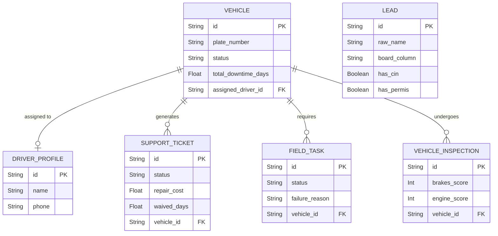

# GoCab CRM: Comprehensive System Architecture & Workflow Document
*An in-depth, technical, and operational guide detailing state management, cross-module handoffs, automated triggers, and database entity relationships within the GoCab CRM ecosystem.*

---

## 1. Executive Summary & Core Philosophy
The GoCab CRM is a reactive, event-driven operational engine designed to manage the entire lifecycle of a driver and physical asset (vehicle). Rather than operating in isolated silos, the modules (Leads, Training, Fleet, Tickets, Field Operations, Insurance) are deeply interconnected. An action in one module (e.g., failing a field task or logging a maintenance ticket) automatically cascades state changes across the relevant entities, eliminating redundant manual data entry and enforcing operational compliance.

---

## 2. High-Level System Architecture & Flow

```mermaid
flowchart TD
    %% Define Styles
    classDef leads fill:#e3f2fd,stroke:#1565c0,stroke-width:2px,color:#000
    classDef training fill:#f3e5f5,stroke:#7b1fa2,stroke-width:2px,color:#000
    classDef fleet fill:#e8f5e9,stroke:#2e7d32,stroke-width:2px,color:#000
    classDef tickets fill:#fff3e0,stroke:#e65100,stroke-width:2px,color:#000
    classDef field fill:#ffebee,stroke:#c62828,stroke-width:2px,color:#000
    classDef insurance fill:#eceff1,stroke:#455a64,stroke-width:2px,color:#000
    classDef dash fill:#fbe9e7,stroke:#d84315,stroke-width:2px,color:#000

    %% Nodes
    A[Marketing Leads / CSV Ingestion] ::: leads
    B[Leads Pre-Screening<br/>(Kanban)] ::: leads
    C[Training & KYC<br/>(Kanban)] ::: training
    D[Fleet Asset Management] ::: fleet
    E[Support Tickets<br/>& Maintenance] ::: tickets
    F[Insurance & Claims<br/>Tracking] ::: insurance
    G[Field Supervisor<br/>(On-Ground Tasks)] ::: field
    H[Executive Dashboard<br/>KPIs & Analytics] ::: dash

    %% Flow Dynamics
    A -- "Raw Data" --> B
    B -- "Offer Accepted / Scheduled" --> C
    C -- "KYC Verified + Vehicle Assigned" --> D
    D -- "Driver Assigned / Status Change" --> H
    D -- "Breakdown / Complaint" --> E
    D -- "Crash / Severe Damage" --> F
    E -- "Vehicle Requires Garage" --> G
    E -- "Accident Category" --> F
    F -- "Repair Finished (Ready for Pickup)" --> G
    G -- "Recovery Completed / Failed" --> E
    G -- "Vehicle Picked Up" --> D
    
    %% Dashboard Feedback Loop
    C -. "Conversion Data" .-> H
    E -. "Downtime Cost" .-> H
    G -. "Task Success Rate" .-> H
```

---

## 3. Deep-Dive: Module Workflows & Logic

### A. Executive Dashboard 📊
**Purpose:** Provide real-time, top-down visibility into operational health.
- **State Inputs:** 
  - `Leads` (Conversion Rate calculation from `NEW_LEADS` to `VEHICLE_ASSIGNMENT`).
  - `Vehicles` (Fleet utilization rate based on `status === 'Actif'` vs total fleet).
  - `Tickets` (Cumulative `total_downtime_days` tracked across resolved tickets).
  - `FieldTasks` (Percentage of tasks reaching `COMPLETED` status).
- **Logic:** Fetches aggregated endpoints (`/api/leads`, `/api/vehicles`, `/api/field-tasks`) on mount to compute metrics. Displays visual distribution using `recharts` for pipeline status and fleet allocation.

---

### B. Leads Module (Acquisition & Pre-Filter) 💼
**Purpose:** Manage raw inbound funnels and attempt initial contact.
- **State Management:** Uses `@dnd-kit` for optimistic UI drag-and-drop state updates. 
- **Columns/Statuses:** `NEW_LEADS`, `Not interested`, `No response 1`, `Training fixed`, `To Recall`, `Wrong number`, `No response 2`, `Already a client`.
- **Automated Triggers:**
  - **Timestamp Tracking:** Moving a lead from `NEW_LEADS` to any other column triggers a `PATCH` updating the `status_changed_at` timestamp.
  - **KPI Pipeline:** The Daily Leads Scorecard uses this timestamp to calculate real-time agent output against daily targets.
  - **Handoff:** Dragging a lead to `Training fixed` automatically shifts its `board_column` state to `TRAINING_PIPELINE` and `training_status` to `Scheduled`.

---

### C. Training & KYC Module 🎓
**Purpose:** Enforce compliance checks, track training attendance, and trigger automated communication.
- **Columns/Statuses:** `Scheduled`, `Attended`, `Pending`, `Preorder`, `Accept offer`, `VEHICLE_ASSIGNMENT`.
- **Validation Logic (Strict Gatekeeping):**
  - The system enforces a **4-point KYC Document Checklist** (CIN, Fiche Anthropométrique, Confirmation d'adresse, Permis).
  - **Blocker:** If a user attempts to drag a lead to `Accept offer` or `VEHICLE_ASSIGNMENT` without `kycCount === 4`, the UI blocks the action, reverting the card and throwing a Toast Error.
- **Automated Triggers:**
  - **WhatsApp API:** Moving a lead to `Accept offer` automatically generates and launches a pre-filled WhatsApp "Thank You & Next Steps" message link.
  - **Financial Tracking:** Moving to `Preorder` opens a drawer input to capture the `preorder_amount`.
  - **Handoff:** Completing this pipeline marks the driver as ready for Fleet assignment.

---

### D. Fleet Management Module 🚗
**Purpose:** Central asset registry tracking vehicle health, driver pairing, and legal compliance.
- **Entity States:**
  - **Operational Status:** `Available`, `Actif`, `In service`, `Accident`, `impounded by police`.
- **Key Logic & Interactivity:**
  - **Smart Driver Linking:** Assigning a driver connects the `Vehicle` entity directly to a `DriverProfile`. A dedicated endpoint (`/api/vehicles/[id]`) manages the atomic unlinking of old drivers and linking of new ones.
  - **Expiration Chron Jobs (Frontend logic):** Dynamically calculates the difference between current dates and `insurance_expiry_date`, `vignette_expiry_date`, and `autorisation_expiry_date`. Flags them as Expired (🚨) or Expiring within 30 days (⚠️).
- **Handoffs:**
  - Changing a vehicle status to `Accident` directly triggers logic that expects an associated `AccidentClaim` record.

---

### E. Support & Maintenance Tickets 🔧
**Purpose:** Resolution tracking for mechanical breakdowns, complaints, and financial waivers.
- **Workflow Pipeline:** `OPEN` ➔ `IN_PROGRESS` ➔ `WAITING` ➔ `RESOLVED`.
- **Complex Logic & Automations:**
  - **Payment Waivers:** Agents can apply or cancel payment waivers (days the driver doesn't pay lease due to breakdown).
  - **Resolution Engine:** When a ticket is dragged to `RESOLVED`, a forced modal requires the agent to input:
    - `repair_cost` (Float tracking financial impact).
    - `garage_name` (String tracking vendor).
    - `resolution_notes` (Context).
  - **Downtime Auto-Calculation:** Upon resolving, the system calculates the exact hours/days between `created_at` and `resolved_at`, storing it in `total_downtime_days` to feed the Executive Dashboard.
  - **Vehicle Auto-Restore:** Resolving a ticket automatically executes a sub-routine that reverts the attached Vehicle's status back to `Actif`.

---

### F. Insurance & Accidents 📝
**Purpose:** A highly specialized linear pipeline for tracking the complex lifecycle of an accident repair.
- **Timeline Logic (Sequential):**
  1. `New Accident`
  2. `Car in Garage`
  3. `Starting Repair`
  4. `Insurance Docs`
  5. `Ready for Pickup` 
  6. `Vehicle Back`
- **Automated Handoffs:**
  - When the timeline reaches step 5 (`Ready for Pickup`), the system theoretically flags the need for on-the-ground extraction, passing the baton to the Field Supervisor module.

---

### G. Field Supervisor (On-Ground Ops) 🛡️
**Purpose:** Track physical actions required by field agents (vehicle repossession, towing, garage pickups, physical checkups).
- **Task Types:** `VEHICLE_RECOVERY`, `GARAGE_PICKUP`, `MONTHLY_CHECKUP`.
- **Status Lifecycle:** `PENDING` ➔ `IN_PROGRESS` ➔ `COMPLETED` or `FAILED`.
- **Failure Logic:** Tasks cannot just be "failed". The UI forces a "Failure Reason" modal to capture context (e.g., "Driver refused to hand over keys", "Garage closed"), updating the entity via PATCH.
- **Physical Inspections:** Sub-module allowing field agents to submit a comprehensive 10-point vehicle health checklist.
  - Calculates aggregated scores (Tires, Brakes, Engine).
  - Appends categorized `[Visual Damages: ...]` directly to the vehicle's notes.
  - Updates the vehicle's `current_mileage`.

---

## 4. UI/UX Design System & Feedback Loops
The CRM utilizes a premium, state-of-the-art UI methodology to ensure high agent adoption and minimize friction:
- **Glassmorphism:** Navigation and modals utilize frosted glass (`backdrop-blur`) and semi-transparent backgrounds to create depth.
- **Optimistic UI:** Drag-and-drop actions immediately update the local React state before the API resolves. If the API fails, the state gracefully reverts, preventing UI blocking.
- **Global Toast Notifications:** `react-hot-toast` is integrated system-wide. Every CRUD action (resolving tickets, completing field tasks, saving vehicles) returns a sleek success/error popup, completely replacing intrusive browser `alert()` dialogs.
- **Brand Consistency:** Global color tokens (`--color-navy: #35588F`, `--color-olive: #5D6B2D`) directly match the GoCab logo, paired with a clean white-space heavy layout.

---

## 5. Database Entity Relationships (Prisma ERD)
The underlying architecture enforces data integrity through relational mappings in SQLite/Postgres.


