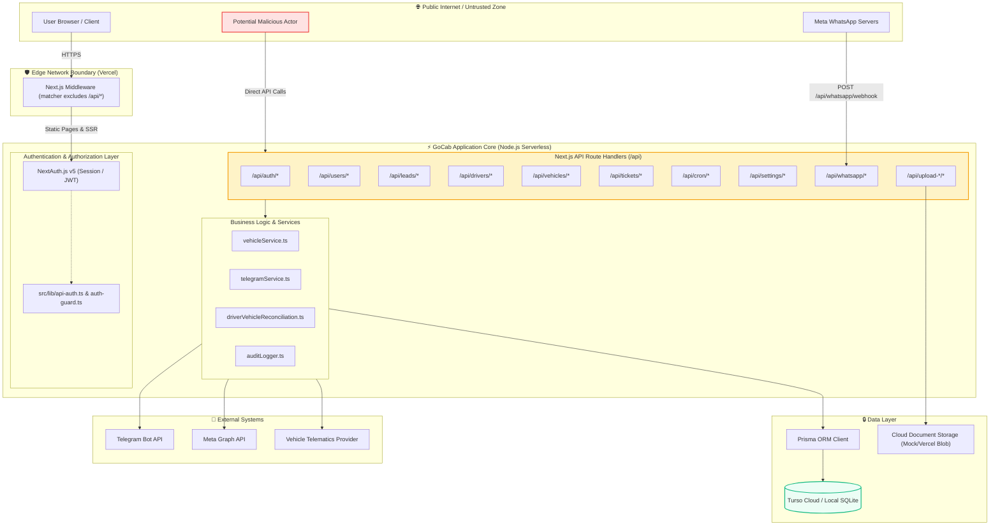

# GoCab CRM — Phase 1: Repository Reconnaissance & System Mapping
**Document ID:** `01-reconocimiento.md`  
**Date:** 2026-10-09  
**Auditing Team:** Senior Multidisciplinary Engineering Team (AppSec, Software Architect, SRE/DevOps, QA Lead, Compliance Auditor)  
**Target Repository:** `Gocab` (Commit: `961fb75`)

---

## 1. System Context & Criticality

| Attribute | Specification |
|---|---|
| **System Name** | GoCab Operational CRM & Fleet Management Platform (`gocab-crm`) |
| **Business Domain** | B2B Fleet Mobility Operator & Driver KYC (Casablanca, Morocco) |
| **Primary Mission** | Manage physical fleet assets, onboarding KYC pipeline, contract enforcement, automated daily billing, debt recovery, and garage maintenance. |
| **System Criticality** | **Tier 1 (High)**: Directly orchestrates physical vehicle access, driver payments, telematic engine kill commands, regulatory road compliance, and sensitive PII. |
| **Supported Environments** | Production (Vercel Edge / Serverless), Turso Cloud Database (LibSQL), Local Development (SQLite `dev.db`). |
| **Compliance Scope** | Moroccan Law 09-08 (CNDP) & GDPR (PII: CIN, Criminal records, Driving license), SOC2 (Access controls, Encryption, Change management), ISO 27001 (A.8.2, A.8.24). |

---

## 2. Technology Stack & Manifest Inventory

- **Framework:** Next.js 16.3.0 (React 19.2.8, App Router)
- **Language / Runtime:** TypeScript 5, Node.js 20+
- **Styling:** Tailwind CSS v4, PostCSS
- **Database / ORM:** Prisma 7.9.1 with `@prisma/adapter-libsql`, `@libsql/client`, `better-sqlite3`, SQLite / Turso
- **Authentication:** NextAuth v5.0.0-beta.25 (`@auth/core`), `bcryptjs`
- **Integrations:**
  - Meta WhatsApp Cloud API / 360dialog
  - Telegram Bot API (Operational recovery missions & field notifications)
  - Telematics API (GPS ping & remote engine ignition blocks)
  - SheetJS (`xlsx`), PapaParse (CSV/Excel ingestion)

---

## 3. Architecture & Trust Boundary Diagram

---

## 4. Entry Points & Critical Paths

1. **Identity & Access Management:**
   - `POST /api/auth/[...nextauth]`
   - `POST /api/users/change-password` *(Critical Risk Identified)*
   - `GET /api/seed` *(Critical Risk Identified)*
   - `GET /api/settings` & `POST /api/settings` *(Critical Risk Identified)*

2. **Lead Acquisition & KYC Funnel:**
   - `GET /api/leads`, `POST /api/leads`, `PATCH /api/leads/[id]`
   - `POST /api/upload-leads` (CSV/XLSX bulk parser)
   - `POST /api/upload-document` (CIN, Permis, Fiche Anthropométrique)

3. **Fleet & Driver Operations:**
   - `GET /api/drivers`, `PATCH /api/drivers/[id]`, `DELETE /api/drivers/[id]`
   - `GET /api/vehicles`, `PATCH /api/vehicles/[id]`, `POST /api/vehicles/assign`
   - `POST /api/upload-drivers`, `POST /api/upload-vehicles`

4. **Maintenance, Incidents & Recovery:**
   - `GET /api/tickets`, `POST /api/tickets`, `PATCH /api/tickets/[id]`, `DELETE /api/tickets/[id]`
   - `GET /api/accidents`, `PATCH /api/accidents/[id]`
   - `GET /api/field-tasks`, `PATCH /api/field-tasks/[id]`

5. **Automated Scheduled Jobs (Crons):**
   - `POST /api/cron/daily-billing`
   - `POST /api/cron/escalation`
   - `POST /api/cron/predictive-maintenance`

6. **External Integrations:**
   - `GET|POST /api/whatsapp/webhook`
   - `POST /api/telegram/test`

---

## 5. Initial Risk Surface Summary

- **Authentication Coverage Gap:** ~60% of API endpoints do not invoke `requireAuth()`. The Edge middleware explicitly bypasses `/api/*`.
- **Credential Storage:** Hardcoded passwords in `/api/seed`, hardcoded JWT secret fallback in `auth.config.ts`, plaintext secrets in `/api/settings`.
- **Privilege Escalation:** Unauthenticated self-service password reset on `/api/users/change-password` allowing total account takeover.
- **Data Protection & Compliance:** Driver identity cards, criminal record indicators, and contact details are publicly readable over `/api/leads` and `/api/drivers`.
- **Supply Chain:** 19 npm vulnerabilities identified (Next.js RCE/SSRF, SheetJS ReDoS/Prototype Pollution).
